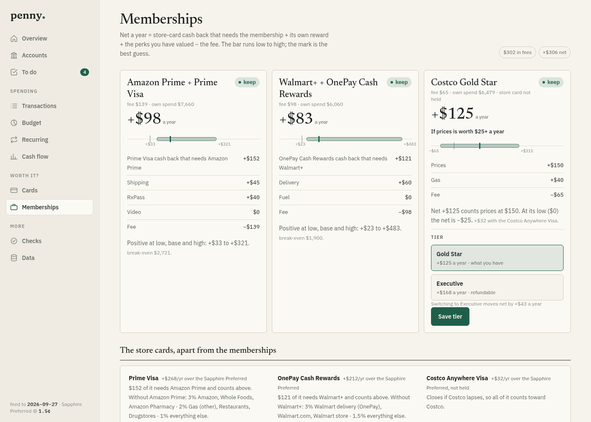
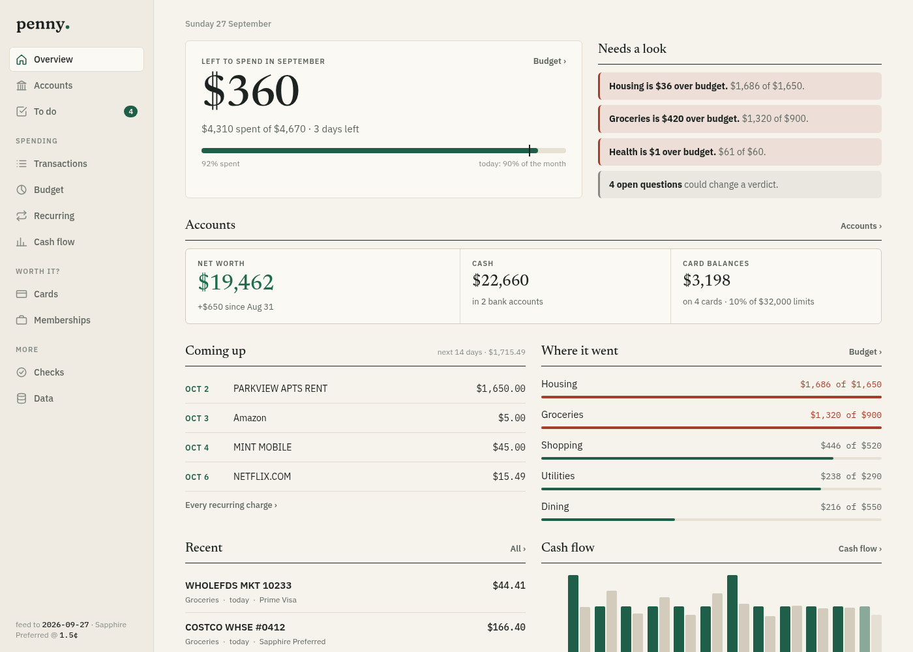

<h1>
  <picture>
    <source media="(prefers-color-scheme: dark)" srcset="docs/design/logo/final/penny-wordmark-dark.svg">
    
  </picture>
</h1>

[](https://github.com/tydude001/penny/actions/workflows/ci.yml)
[](https://www.python.org/)
[](LICENSE)

Is each paid membership, and the store card that comes with it, actually
worth it? penny answers that from your own card feed, for:

- **Amazon Prime** with Amazon Pharmacy and the Prime Visa
- **Walmart+** with the OnePay Cash Rewards card
- **Costco** Gold Star vs Executive, with and without the Costco Anywhere Visa

Other tools (Actual Budget, Firefly III, Beancount) will track where your
money went. penny is built around one question those don't answer: is the
membership and its card worth the fee, this year, on how you actually spend?
The budget tracker (spending by category, cash flow, net worth) comes along
for free on the same data, but the membership math is the point.
[`docs/competitors.md`](docs/competitors.md) compares Sure, Securo,
KevFin and Tallyo in detail.



<details>
<summary>The budget board's overview</summary>



</details>

<sub>Screenshots are `penny demo`: a synthetic year of data, no real accounts.</sub>

## Quick start

```bash
git clone https://github.com/tydude001/penny.git
cd penny
uv sync
uv run penny demo     # a year of synthetic transactions, then serves the board on http://127.0.0.1:8766
```

`demo` writes nothing outside its own throwaway instance — it's the fastest
way to see the board and the math with no data of your own.

To use it for real:

```bash
uv run penny init                                          # writes ./home
uv run penny import csv export.csv --preset rocket         # or --preset apple; any other bank maps its own columns
uv run penny report
uv run penny board
```

`tests/fixtures/sample.csv` is a small Rocket Money-shaped file to try the
steps on. Any other bank's CSV takes a column map; amounts are read as positive = money
out, and `--negate` flips a file that writes purchases negative:

```bash
uv run penny import csv card.csv --date "Posting Date" --amount Amount --description Details --last4 4242 --negate
```

Imports land in `data/imports/`, one file per source (importing the same file
again replaces it), and `report`, `categories` and the board read them with no
further flags.

Every path penny reads or writes resolves against an **instance directory**:
the `--home` flag, else the `PENNY_HOME` environment variable, else `./home`
in the current directory. That's `rules.toml` (what you hold), `assumptions.toml`
(what perks are worth to you), and `data/` (your imports and feed state) —
nothing else on the machine is touched, and `home/` is git-ignored by default.

## The math

For each membership, per year:

    net = from membership + tier reward + perks − fee

- **card edge** — extra cash back from the store card over your baseline
  card, counted only in categories where the store card wins, over *all*
  spend. This is the *card* question (carry it or not). The Costco Visa
  earns on gas and restaurants, not mainly at Costco.
- **from membership** — the part of that edge the membership causes: the
  card's rates with the membership minus its `without_membership_rates` (the
  Prime Visa pays 3% without Prime, OnePay 3% without Walmart+). A card with
  `requires_membership = true` attributes its whole edge. This is the
  *membership* question, and the only card term in `net`.
- **tier reward** — the membership's own rebate (Costco Executive 2%,
  capped), paid only on the tier's `reward_families` when the rebate skips
  one the membership enables — Costco's 2% does not pay on gasoline.
- **perks** — hand-estimated value of shipping, delivery, RxPass, price
  advantage, from `assumptions.toml` at low / base / high. Zero until you
  fill them in, so the first report is pure cash-back math.
- **fee** — the list fee from `rules.toml`; the fee actually charged in the
  window is printed beside it, flagged when it is off every list fee by more
  than $1 or 5%, whichever is larger.

The report also gives a **break-even**: annual spend on that membership's own
families at which net(base) = 0, holding the current mix.

Two card blocks sit apart from every membership net. **Fees and credits**,
per anniversary year, come from `[card_credits.*]` in `rules.toml`, matched
by descriptor and read with no category excluded, since card exports often
file credits as payments and transfers. **Card worth** is earn + benefits −
`annual_fee` at low / base / high for each `[card_worth].alternatives` card
in `assumptions.toml`, on the spend the first one carries.

What the data cannot say and this repo does not pretend to: whether you would
have bought the same things elsewhere without the membership. **This is not
financial advice** — it's arithmetic on the rates and fees you tell it about,
and every unverified rate is flagged as such until you check it.

## The board

`penny board` serves a local dashboard: this month's spending against budget,
what needs a look, recurring charges due soon, where the month went, the
memberships' net, the baseline card's worth, and where to swipe each
category. Pages for accounts and net worth, cash flow by month, every card's
edge, each membership's verdict, open questions, and the raw transaction
feed (with per-row and per-merchant hand overrides). Everything is derived
fresh on each load from `rules.toml`, `assumptions.toml` and your imported
feed; saving an answer on the board writes it into the TOML files in place
(comments kept) — it never commits.

It binds `127.0.0.1` by default. `--tailscale` binds your Tailscale IPv4
instead, for reaching it from another device on your own tailnet. `--host`
still works for anything else, but prints a warning: the board edits config
files and shows every transaction, and localhost is the only setup this repo
calls supported until a login token lands (see `SECURITY.md`).

The board also takes Apple Card files by upload: `POST /import/apple` with a
Wallet CSV export or an Apple Card statement PDF as the raw request body does
what `penny import apple FILE` does and answers with the same lines. It's
meant for an iOS Shortcut shown in the share sheet — **Get Contents of URL**,
method POST, request body **File** set to the Shortcut Input, then **Quick
Look** on the result — with the board on `--tailscale`. The Host and Origin
checks that guard the Record endpoint apply to it too.

## Privacy

Nothing leaves your machine except calls to Plaid's API, and only if you set
up your own Plaid developer keys — penny ships none, and the demo and CSV
import need no network at all. Everything penny stores lives under your
instance directory (`home/` by default): the TOML config, imported CSVs,
Plaid's sync cursor and tokens, and hand overrides. None of it is committed —
the public repo's `.gitignore` keeps `/home/` out, and `penny init` writes
`data/` at a locked-down mode.

Card rates and fees shipped in `penny/defaults/rules.toml` carry a
`verified_on` date. They go stale — terms change — so the board flags
anything unverified or overdue and the report lists the unverified ones at
the bottom. Check them against the actual card and membership terms before
trusting a verdict.

## Advanced: Plaid

Plaid link is supported for banks that don't give you a clean CSV export, but
it's bring-your-own-keys: sign up for a Plaid developer account, rehearse in
Sandbox (`penny plaid sandbox-item`) before linking anything real, and
**never relink an Item** — most trial tiers cap production Items and removing
one doesn't free its slot. Adding a product or fixing a login goes through
Link's update mode on the same Item (`penny plaid link --relogin ITEM`), not
a fresh link. See `penny plaid --help` for the rest.

## Layout

- `penny/load.py`, `penny/feed.py` — CSV and Plaid transactions → `Txn`,
  sign and transfers normalised, and a card purchase made through a linked
  PayPal counted once, on the card
- `penny/categorize.py` — merchant regex + category fallback → family
- `penny/model.py` — the membership math above
- `penny/report.py` — text tables
- `penny/cardworth.py` — card fee/credit detection per anniversary year, and
  card worth (earn + benefits − fee)
- `penny/board.py` — `penny board`: decisions derived from the files,
  verdict rows, card rows and where to swipe, the allowlisted Record endpoint
- `penny/tomledit.py` — line-based TOML value edits that keep every comment
- `penny/fsio.py` — the one atomic, fsynced file replace every writer uses
- `penny/plaid.py` — `penny plaid link|sync|status`: the Plaid feed
- `penny/compare.py` — `penny compare`: spend by family, account and
  merchant across two sources over one window
- `penny/networth.py` — every account's newest balance and month-end net worth
- `penny/check.py` — `penny check`: each account's rows tie one known
  balance to the next
- `penny/defaults/rules.toml` — the shipped families, card rates and
  membership catalogue; your instance's `rules.toml` holds only what you
  hold and any override, merged over the defaults
- `tests/` — synthetic fixtures only; `uv run pytest`
- `docs/competitors.md` — how penny compares with Sure, Securo, KevFin and Tallyo
- `docs/design/logo/final/` — the logo kit

## Contributing

See `CONTRIBUTING.md` for the rules a pull request is checked against, and
`SECURITY.md` to report a vulnerability privately.
